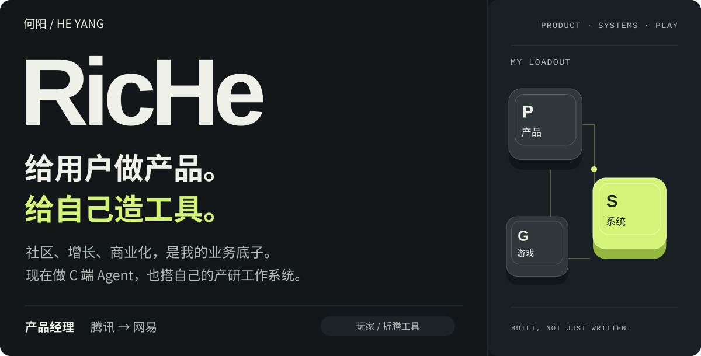
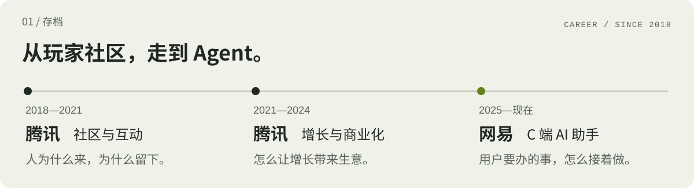
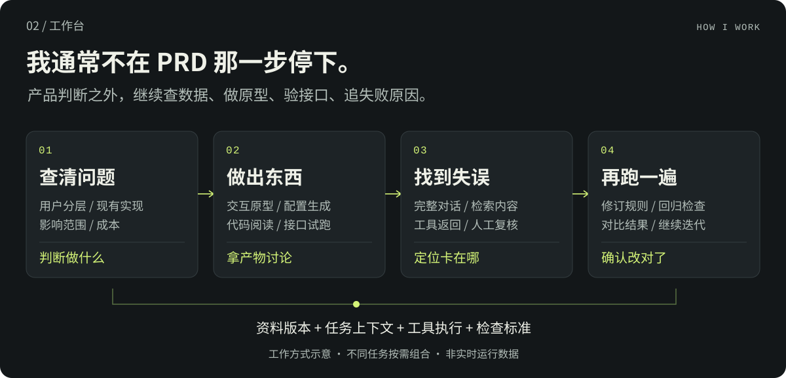
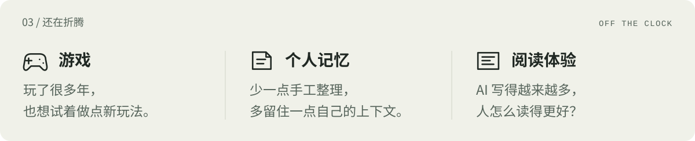
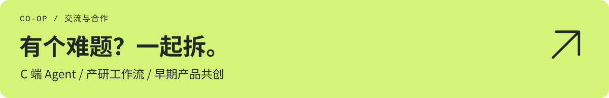

<picture>
  <source media="(max-width: 640px)" srcset="assets/hero-mobile.svg">
  
</picture>

<a href="#career">职业存档</a> · <a href="#work">我的工作台</a> · <a href="notes/practice.md">展开看做法</a> · <a href="https://github.com/hy459229090-lang/ai-pm-workflow/issues/new?title=%5B%E4%BA%A4%E6%B5%81%5D%20">一起聊聊 ↗</a>

<b>我是何阳，也叫 RicHe。</b> 做过社区互动、增长与商业化，目前在网易做 C 端 AI 助手。 自己也爱折腾工具，把资料、执行和验证接进产研流程。玩游戏是兴趣，也是看产品的另一个角度。

<picture>
  <source media="(max-width: 640px)" srcset="assets/journey-mobile.svg">
  
</picture>

<picture>
  <source media="(max-width: 640px)" srcset="assets/workbench-mobile.svg">
  
</picture>

<a href="notes/practice.md">看工作方式与适合合作的问题 →</a>

<picture>
  <source media="(max-width: 640px)" srcset="assets/play-mobile.svg">
  
</picture>

<a href="https://github.com/hy459229090-lang/ai-pm-workflow/issues/new?title=%5B%E4%BA%A4%E6%B5%81%5D%20">
<picture>
  <source media="(max-width: 640px)" srcset="assets/contact-mobile.svg">
  
</picture>
</a>

带着你正在做的东西，或者一个卡住的问题来就好。

留言是公开的，请勿提交公司资料或个人隐私。这里仅介绍个人经历与方法。

English / text-only introduction

### He Yang · RicHe

Product manager at NetEase, previously at Tencent. My background spans community products, growth and monetization. I now work on consumer AI assistants and build tools for my own product workflow.

I work across product decisions, data analysis, interactive prototypes, interface validation and agent evaluation. I review complete conversations alongside retrieval and tool results, not only the final answer. The workflow shown above is illustrative; different tasks use different parts.

Outside work, I explore games, user-controlled personal memory and reading experiences. Interested in collaborating on consumer agents, practical product workflows and early-stage products.

Project names and business data are deliberately omitted. GitHub messages are public.

